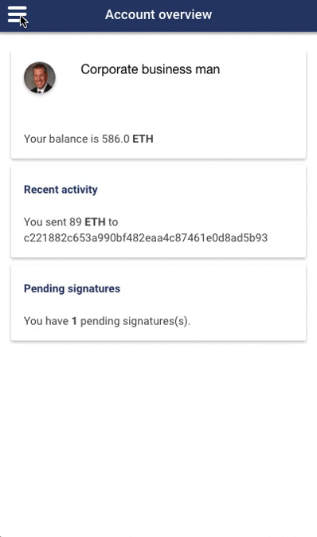

# nimbus



Ionic + Material + ngCordova (touch, keychain) + blockapps-js + IPFS + persona

## Requirements

[`bloc`](http://github.com/blockapps/bloc)

## Installation

`npm install`
`ionic platform add [platform]`
`ionic emulate -lc --address=localhost [platform]`

where `[platform]` can be `ios, browser, android, ubuntu`...

## Preparations

For now a couple of things are hard-coded into the app and you need to prepare accordingly.

Addresses hard-coded (for now) are: 
- `903b4a914940f08399e41dddcab8e1ea8939cbab` for pirate
- `1cee1690d65268ca551bcd2791c570a8fcac5e7a` for businessguy

0. `bloc start` in one terminal, compile and upload your favourite contract (on `strato-dev3`)
1. `bloc genkey pirate` and `bloc genkey businessguy` in the other terminal
2. `curl -H 'Content-Type: application/json' --data '{"address":"903b4a914940f08399e41dddcab8e1ea8939cbab", "token":"666", "register":1}' localhost:8000/users/pirate/` and `curl -H 'Content-Type: application/json' --data '{"address":"1cee1690d65268ca551bcd2791c570a8fcac5e7a", "token":"667", "register":1}' localhost:8000/users/businessguy/` (right now token is ignored but this should later be a token to identify the phone)
3. Open your contract in the browser and see that you can now call contracts with these newly added addresses. They will be pending on the phone - you can confirm this by calling for example `localhost:8000/addresses/1cee1690d65268ca551bcd2791c570a8fcac5e7a/pending`

## Usage

1. Open `nimbus` after installing it. Go to `pending transactions` under your chosen user. You should see them populate as you repeate the commands in the preparation above.
2. Sign (or delete) a transaction and see it update in the transaction status. You might need to click around and refresh. You can also confirm by looking at the `/pending` route, above.

## Example use case

Consider the following contract that pays out dividends to two persona:

```javascript
contract Payout {
     address Pirate;
     address Businessguy;

     mapping (address => uint) ownershipDistribution; 

     function Setup() {
       Pirate       = 0x903b4a914940f08399e41dddcab8e1ea8939cbab;
       Businessguy  = 0x1cee1690d65268ca551bcd2791c570a8fcac5e7a;

       ownershipDistribution[Pirate]       = 35;
       ownershipDistribution[Businessguy]  = 65;
     }

     function Dividend() {
       uint bal = this.balance;
       Pirate.send(bal * ownershipDistribution[Pirate] / 100); 
       Businessguy.send(bal * ownershipDistribution[Businessguy] / 100);
     }
}
```


